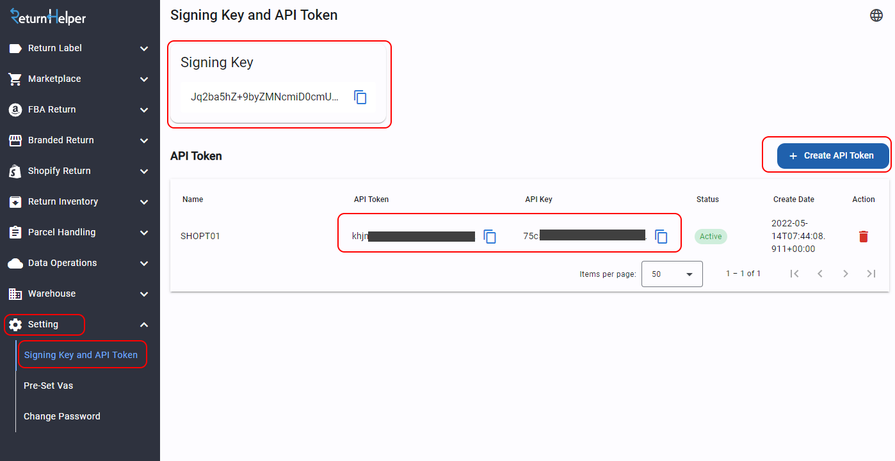

.. Return Helper API documentation master file, created by
   sphinx-quickstart on Tue May  5 23:54:44 2020.
   You can adapt this file completely to your liking, but it should at least
   contain the root `toctree` directive.

Return Helper API
==================

About this documentation
------------------------

This documentation listed the functions of Return Helper API.

Each function is provided with request and response object definition (if exist).
Some objects may have an inherit class that you can use the parameters from it.

**Our API is only designed for Server to Server integration.**

Changelog
---------

.. list-table::
   :widths: 25 75
   :header-rows: 1

   * - Version
     - Description
   * - 2023-03
     - Add description about ``label_id`` in :ref:`notification-label`
   * - 2023-06
     - Add API endpoint for China user
   * - 2023-07
     - Release new API :ref:`method-createreturnshipment`, replacing :ref:`method-createreturnrequest` and :ref:`method-createlabel`
   * - 2024-02
     - Remove ``x-api-key`` from request header, this value is no longer required for API access
   * - 2024-03
     - Update :ref:`index-idempotency` section

.. _index-Authenication:

Authenication
-------------

Getting your API key and token:

1. Login to Return Helper User Portal.
2. Go to Setting > Signing Key and API Token
3. You can see all of your API key and token here. You can also create a new pair here.

Put authenication keys in your request header:

::

    x-rr-apikey: (your key)
    x-rr-apitoken: (your token)
    Content-Type: "application/json"

``API TOKEN`` is private and should never be shared to others.

Clients must submit a webhook setup request in order to receive notifications from Return Helper :ref:`notification`

.. _index-Idempotency:

Idempotency
-----------

An idempotency key in an API call is a unique value, often a UUID or a similarly complex string, generated by the client to ensure that repeating the same request does not inadvertently perform the action more than once.

This mechanism is crucial for operations that modify data or state, such as creating resources (return shipments, inventories, etc), where duplicate requests could lead to unwanted consequences like multiple charges.

To prepare the key, the client should generate a unique identifier for each transactional request and include it in the API call's headers. This enables our servers to recognize repeat submissions of the same operation, ensuring the action is executed only once and preserving data integrity and consistency, even in scenarios with network retries or other issues.

User Agent
----------

We strongly recommend including the user agent in your request header to help us identify the source of the request. This will enable us to offer enhanced support, particularly for API-related issues like updates and changes.

Your User-Agent should be in below format:

:: 
  
      User-Agent: {application name}/{application version} (Platform={os release version}; Runtime={(runtime | sdk) version}; Language={language})

e.g. CompanyABCApi/2024.16.0 (Platform=Unix/13.4.0; Runtime=8.0.2; Language=CSharp12)

Your request header should looks like:

.. code-block:: http
  :emphasize-lines: 4,5

    x-rr-apikey: (your key)
    x-rr-apitoken: (your token)
    Content-Type: "application/json"
    x-returnhelper-idempotency-key: (your key)
    User-Agent: (your user agent)

API Endpoints
-------------

- Sandbox

+----------------------+----------------------------------------------+
|rh-api-user-endpoint  | https://api.returnshelper.com/uat/user/api   |
+----------------------+----------------------------------------------+
|rh-api-public-endpoint| https://api.returnshelper.com/uat/public/api |
+----------------------+----------------------------------------------+
| User Web Portal URL  | https://devusr.returnshelper.com/            |
+----------------------+----------------------------------------------+

- Production

+-------------------------------+--------------------------------------------------+
|rh-api-user-endpoint           | https://api.returnhelpercentre.com/v1/user/api   |
+-------------------------------+--------------------------------------------------+
|rh-api-user-endpoint for China | https://api.returnhelperchina.com/user/          |
+-------------------------------+--------------------------------------------------+
|rh-api-public-endpoint         | https://api.returnhelpercentre.com/v1/public/api |
+-------------------------------+--------------------------------------------------+
| User Web Portal URL           | http://user.returnhelpercentre.com/              |
+-------------------------------+--------------------------------------------------+

General Remarks
---------------

- Parameter ``dateTime`` must be ``ISO8601`` format, otherwise API won't be able to parse it.
- Date string parameter e.g. ``createToStr``/ ``createFromStr`` must be ISO8601 and time part is omitted by API.
- All time return is UTC.

----

.. toctree::
   :maxdepth: 4
   :caption: Contents:

   Home <index>
   Getting Started <getting_start>
   Base Models <base_model>
   Data Structure <data_structure>
   Return Public Api <return_public_api>
   Return User Api <return_user_api>
   Webhook <Webhook>
   Label Service Limitation <label_service_limitation>