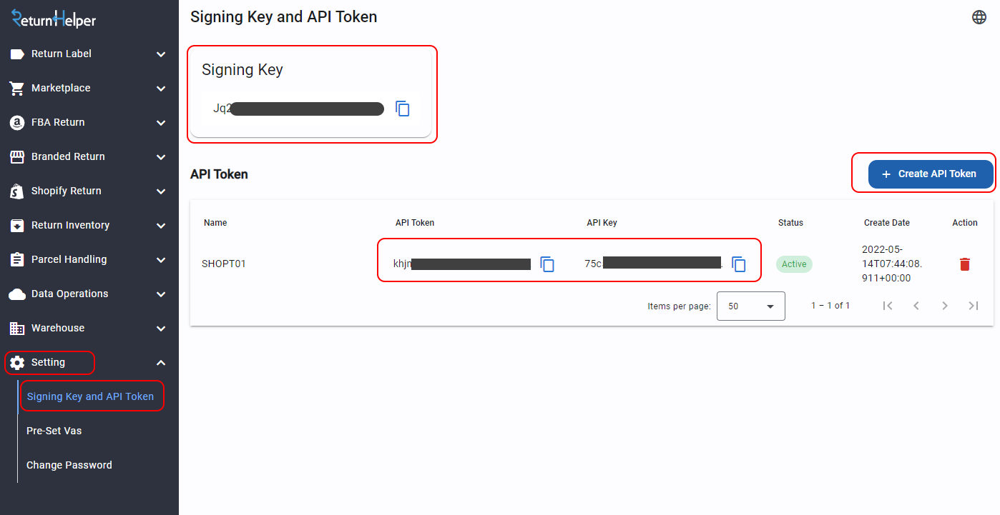

.. Return Helper API documentation master file, created by
   sphinx-quickstart on Tue May  5 23:54:44 2020.
   You can adapt this file completely to your liking, but it should at least
   contain the root `toctree` directive.

Return Helper API
==================

.. _index-Announcement:

Important Announcement
**********************

.. warning::
  This is a breaking changes effetive from 1st March 2025. Any integrations that assigning values to ``<objectName>Number`` fields will be rejected by the API. Please make sure to update your integration to use ``sellerReferenceNumber`` field before 1st March 2025.

We are improving our API user experience by migrating ``sellerReferenceNumber`` as a optional and searchable field throughout the API.
This field will be serve as a **non-unique** data field for customers to store their own data, which enable a more flexible business flow.

The ``sellerReferenceNumber`` field is added to the below data structures:

- Return Request
- Return Shipment
- Return Inventory
- Return Request Line Item

which are used in the following API functions:

- :ref:`method-createReturnRequest`
- :ref:`method-editReturnRequest`
- :ref:`method-createreturnshipment`

API users should use this field to store their reference (such as order number, invoice number, etc).
Since this is a non-unique field, you are reminded to pay more attention if you are using it as a matching key in your system.

This new ``sellerReferenceNumber`` field will also be included during the return workflow API exchanges, such as:

- :ref:`notification-warehouseMarkShipmentArrivedv2`
- :ref:`notification-MarkReceived`
- :ref:`notification-assignUnknown`
- etc

Meanwhile, all of our ``<objectName>Number`` fields
(e.g. ``returnRequestNumber``, ``shipmentNumber``, ``returnRequestLineItemNumber``)
will be changed to non-assignable. Meaning that these field values will be generated by Return Helper system and cannot be assigned by API users.

In order to provide a smooth transition, we are introducing a migration period regarding to the above changes:

Migration period (from now to 28th February 2025)
-------------------------------------------------

We have a few tempority updates to make sure existing users are not affected by the changes during the migration period.

- API still allows the use of ``<objectName>Number`` fields
- all ``<objectName>Number`` values in API requests are automatically transferred to the new ``sellerReferenceNumber`` field
- all ``<objectName>Number`` fields will be generated by Return Helper system
- Either ``<objectName>Number`` or ``sellerReferenceNumber`` can be used in the request, otherwise the system will return a validation error
- All notifications will include both ``<objectName>Number`` and ``sellerReferenceNumber`` fields, with the same value of ``sellerReferenceNumber``

Consider the following request:

.. code-block:: json

  {
      "returnRequestNumber": "my-return-number",
      "shipment": {
          "shipmentNumber": "my-shipment-number"
      },
      "returnRequestLineItems": [
          {
              "returnRequestLineItemNumber": "my-line-item-number"
          }
      ]
  }

The data will be transformed and stored in our system as below:

.. csv-table::
    :header: "Field", "Value"
    :widths: 40, 60

    "returnRequestNumber", "*<<system generated string>>*"
    "sellerReferenceNumber", "my-return-number"
    "shipment.shipmentNumber", "*<<system generated string>>*"
    "shipment.sellerReferenceNumber", "my-shipment-number"
    "returnRequestLineItems.returnRequestLineItemNumber", "*<<system generated string>>*"
    "returnRequestLineItems.sellerReferenceNumber", "my-line-item-number"

However to ensure all existing API integrations are not affected,
we replace the value of ``<objectName>Number`` with ``sellerReferenceNumber`` field in our notifications.

.. code-block:: json

    {
        "returnRequestNumber": "my-return-number",
        "sellerReferenceNumber": "my-return-number"
        "shipment": {
            "shipmentNumber": "my-shipment-number",
            "sellerReferenceNumber": "my-shipment-number"
        },
        "returnRequestLineItems": [
            {
                "returnRequestLineItemNumber": "my-line-item-number",
                "sellerReferenceNumber": "my-line-item-number"
            }
        ]
    }

Migration completed (from 1st March 2025)
-----------------------------------------

From 1st March 2025, all tempority changes of the Migration period will be removed.
API will reject any requests that contains ``<objectName>Number`` fields.

Please make sure to update your API integration to use ``sellerReferenceNumber`` instead of ``<objectName>Number`` before 1st March 2025.

We will then release new API functions to support searching by ``sellerReferenceNumber`` field.

----

About this documentation
************************

This documentation listed the functions of Return Helper API.

Each function is provided with request and response object definition (if exist).
Some objects may have an inherit class that you can use the parameters from it.

**Our API is only designed for Server to Server integration.**

Changelog
*********

.. list-table::
   :widths: 25 75
   :header-rows: 1

   * - Version
     - Description
   * - 2023-03
     - Add description about ``label_id`` in :ref:`notification-label`
   * - 2023-06
     - Add API endpoint for China user
   * - 2023-07
     - Release new API :ref:`method-createreturnshipment`, replacing :ref:`method-createreturnrequest` and :ref:`method-createlabel`
   * - 2024-02
     - Remove ``x-api-key`` from request header, this value is no longer required for API access
   * - 2024-03
     - Update :ref:`index-idempotency` section
   * - 2024-07
     - Add :ref:`notification-warehouseMarkShipmentArrivedv2` and :ref:`notification-inventoryCreated`

       This is an new version of :ref:`notification-MarkReceived` that split into two distinct notifications: mark receive and inventory created.
   * -
     - **BREAKING**: Deprecating :ref:`notification-MarkReceived` at 31st December 2024. Please use :ref:`notification-warehouseMarkShipmentArrivedv2` and :ref:`notification-inventoryCreated` instead.
   * -
     - Added :ref:`index-deprecating` list
   * -
     - Add descriptions about multiple return inventory within a same shipment to :ref:`gettingstarted-returnarrival`
   * -
     - Add :ref:`gettingstarted-customfield` in :ref:`method-createreturnshipment` and :ref:`notification-warehousemarkshipmentarrivedv2`
   * - 2024-10
     - Add :ref:`method-ConsolidateShipping` and webhook notifications
   * -
     - Add :ref:`miscellaneous_states` reference
   * -
     - Add :ref:`notification-buyerReturnLabelGenerated`
   * - 2024-11
     - Add :ref:`index-Announcement`

.. _index-Deprecating:

Deprecating API
***************

.. list-table::
    :widths: 25 75
    :header-rows: 1

    * - Date
      - Description
    * - 2024-12-31
      - :ref:`method-createreturnrequest`

        :ref:`method-editreturnrequest`

        :ref:`method-createlabel`

        :ref:`notification-MarkReceived`

        :ref:`notification-Resend`

.. _index-Authenication:

Authenication
*************

Getting your API key and token:

1. Login to Return Helper User Portal.
2. Go to Setting > Signing Key and API Token
3. You can see all of your API key and token here. You can also create a new pair here.

Put authenication keys in your request header:

::

    x-rr-apikey: (your key)
    x-rr-apitoken: (your token)
    Content-Type: "application/json"

``API TOKEN`` is private and should never be shared to others.

Clients must submit a webhook setup request in order to receive notifications from Return Helper :ref:`notification`. Please contact us at support@returnhelper.com or fill in this `Google Form <https://forms.gle/iBVkRZvfLQ8o1Nqg8>`_
========================================================================================================================================================================================================================================

.. _index-Idempotency:

Idempotency
***********

An idempotency key in an API call is a unique value, often a UUID or a similarly complex string, generated by the client to ensure that repeating the same request does not inadvertently perform the action more than once.

This mechanism is crucial for operations that modify data or state, such as creating resources (return shipments, inventories, etc), where duplicate requests could lead to unwanted consequences like multiple charges.

To prepare the key, the client should generate a unique identifier for each transactional request and include it in the API call's headers. This enables our servers to recognize repeat submissions of the same operation, ensuring the action is executed only once and preserving data integrity and consistency, even in scenarios with network retries or other issues.

User Agent
**********

We strongly recommend including the user agent in your request header to help us identify the source of the request. This will enable us to offer enhanced support, particularly for API-related issues like updates and changes.

Your User-Agent should be in below format:

::

      User-Agent: {application name}/{application version} (Platform={os release version}; Runtime={(runtime | sdk) version}; Language={language})

e.g. CompanyABCApi/2024.16.0 (Platform=Unix/13.4.0; Runtime=8.0.2; Language=CSharp12)

Your request header should looks like:

.. code-block:: http
  :emphasize-lines: 4,5

    x-rr-apikey: (your key)
    x-rr-apitoken: (your token)
    Content-Type: "application/json"
    x-returnhelper-idempotency-key: (your key)
    User-Agent: (your user agent)

API Endpoints
*************

- Sandbox

+----------------------+----------------------------------------------+
|rh-api-user-endpoint  | https://api.returnshelper.com/uat/user/api   |
+----------------------+----------------------------------------------+
|rh-api-public-endpoint| https://api.returnshelper.com/uat/public/api |
+----------------------+----------------------------------------------+
| User Web Portal URL  | https://devusr.returnshelper.com/            |
+----------------------+----------------------------------------------+

- Production

+-------------------------------+--------------------------------------------------+
|rh-api-user-endpoint           | https://api.returnhelpercentre.com/v1/user/api   |
+-------------------------------+--------------------------------------------------+
|rh-api-user-endpoint for China | https://api.returnhelperchina.com/user/          |
+-------------------------------+--------------------------------------------------+
|rh-api-public-endpoint         | https://api.returnhelpercentre.com/v1/public/api |
+-------------------------------+--------------------------------------------------+
| User Web Portal URL           | http://user.returnhelpercentre.com/              |
+-------------------------------+--------------------------------------------------+

General Remarks
***************

- Parameter ``dateTime`` must be ``ISO8601`` format, otherwise API won't be able to parse it.
- Date string parameter e.g. ``createToStr``/ ``createFromStr`` must be ISO8601 and time part is omitted by API.
- All time return is UTC.

----

.. toctree::
   :maxdepth: 4
   :caption: Contents:

   Getting Started <getting_start>
   Base Models <base_model>
   Data Structure <data_structure>
   Return Public Api <return_public_api>
   Return User Api <return_user_api>
   Webhook <Webhook>
   Label Service Limitation <label_service_limitation>
   Miscellaneous <miscellaneous>